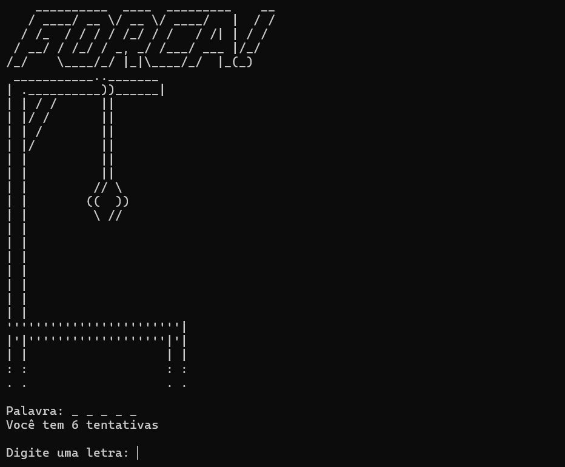

# 🎮 Jogo da Forca em Python

Este é um jogo da **Forca** desenvolvido em **Python**, executado diretamente no terminal.
O projeto tem foco educacional, ideal para praticar **lógica de programação**, **listas**, **strings**, **loops** e **funções**.



## 🧠 Como funciona

* Uma palavra é escolhida aleatoriamente de uma lista interna.
* O jogador deve adivinhar a palavra digitando **uma letra por vez**.
* A cada erro, uma parte do boneco da forca é desenhada em ASCII.
* O jogo termina quando o jogador **acerta a palavra** ou **fica sem tentativas**.

## 🛠 Tecnologias utilizadas

* Python 3
* Biblioteca padrão `random`

## ▶️ Como executar

1. Clone o repositório:

    ```bash
    git clone https://github.com/seu-usuario/seu-repositorio.git
    ```

2. Entre na pasta do projeto:

    ```bash
    cd seu-repositorio
    ```

3. Execute o jogo:

    ```bash
    python forca.py
    ```

> ⚠️ Use `python3` caso seu sistema utilize essa versão por padrão.

## 🎯 Regras do jogo

* Digite apenas **uma letra por vez**
* Letras repetidas não são aceitas
* Apenas letras do alfabeto são válidas
* O jogador possui **6 tentativas**

## 📁 Estrutura do código

* `desenhar_forca()` → desenha a forca conforme os erros
* `jogar_forca()` → controla toda a lógica do jogo
* `iniciar_jogo()` → loop principal permite jogar novamente ao final

## 📚 Objetivo do projeto

Este projeto foi criado com fins de **aprendizado**, para reforçar conceitos básicos da linguagem Python e lógica de programação.
